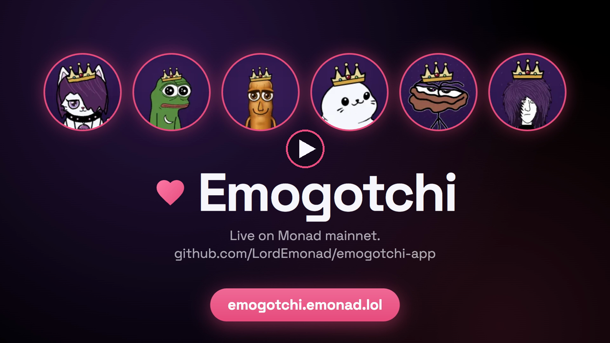

# Emogotchi

**A pet that lives in your wallet, on Monad.** Feed it, wash it, play with it, put it to bed. Every action is a Monad
transaction, the pet's whole life is stored on chain (its picture too), and if it goes hungry for two days it dies.

- **Live:** https://emogotchi.emonad.lol
- **Demo video:** https://youtu.be/CiL8blAMIZs (3 min)
- **Track:** 03, Social, Attention & Culture
- **Chain:** Monad mainnet (chain id 143). Every contract below is verified on Sourcify (exact match).

[](https://youtu.be/CiL8blAMIZs)

As of 2026-10-07 there are **83,316 pets** across six collections. Their care has bought and burned
**607,000+ $EMO**, and **135 fights** have been challenged in Fight Club.

## The problem, and who it is for

Communities on Monad have tokens and mascots, and not much to *do* together from one day to the next. Holding is
passive and attention drifts. The people who could join usually have no wallet, so they never start.

Emogotchi turns a community's mascot into a pet you keep alive, together with everyone else keeping theirs:

- a daily reason to come back (the meters drain, and only hunger kills);
- something to show for it (a care score, a live crown for the best-kept 100 pets, outfits and rooms);
- a place to meet (Emotown, a street where the day's active pets walk around and their owners chat);
- a cost that feeds the community's token (care and names buy $EMO and burn it).

**Who it is for:** members of Monad communities ($EMO holders, and the communities whose mascots became pets here),
and people new to crypto. A newcomer can start with Face ID or a fingerprint (a passkey account) instead of a
wallet, and is given enough MON for gas to mint a free pet and look after it for a week.

## What is in it

- **Six pets**, each its own ERC-721 contract with the same rules:
  - **The cat** (Emogotchi): 82,423 were airdropped to Monad wallets at launch. Each care costs 1 MON.
  - **inversebrah, Tung Tung Tung Sahur, Thiccums, the r3tard and Emonad** (the $EMO mascot): free to mint, one per
    wallet, and free to care for (gas only).
- **Life on chain:**
  - Four meters (food, clean, fun, energy), each stored as a timestamp and read live.
  - Sleep, a poop that shows up after meals, death after two days without food, and revival.
  - A name, a streak, a care score (the 7-day average of the meters) and a full lifetime record. All of it moves with
    the NFT.
- **On-chain pictures:** `tokenURI` builds the pet's portrait as an SVG for its current mood (nine moods, crowned or
  not) from art stored in contracts. There is no IPFS and no image server.
- **Burns $EMO:** 80% of every care and name payment queues to buy $EMO on nad.fun and burn it. Anyone can press the
  site's burn button (`crankBurn`).
- **Item shop:** an ERC-1155 shop with 31 items: outfits, hats, room themes, toys and companions.
  - Items are drawn into the pets themselves, so they move with every animation.
  - Toys and companions change what Play and Pet do.
  - Some items are gated by other contracts (hold a named pet; hold 7,000 $EMO).
- **Emotown:** a side-scrolling town where every pet looked after in the last 24 hours walks around, doing the actions
  its owner just sent on chain.
  - Owners sign in with Sign-In with Ethereum. Posting needs a named pet.
  - Chat shows up as speech bubbles over the pets. There are also profiles, follows, DMs, GIFs and reactions.
- **Fight Club:** two pets fight for MON. A random number from Pyth Entropy picks the winner (a fair 50/50), and the
  winner takes the pot less 5%.
- **No wallet needed:** a passkey account (built on [mera](https://www.npmjs.com/package/@category-labs/mera)) gives
  you a real Monad key, derived in the page from your passkey. WalletConnect and browser wallets work too.
- **Add MON from other chains:** top up from ETH, BNB, USDC or USDT on seven EVM chains through Relay, then play on
  Monad as usual.
- **Also:**
  - Live stats, a gallery and leaderboards, all read from the chain.
  - Push notifications ("your pet is hungry"), an installable home-screen app and sound.
  - A version for the Rabbit r1 (`/r1`).

## How it uses Monad, and why Monad

- **Every action is a transaction.** Over 83,000 pets, each needing care every day, only works when a transaction is
  cheap and quick to confirm:
  - A free pet's care action costs about 0.012 MON in gas, well under a cent.
  - The animation plays when the transaction lands, so it feels like a game, not a form.
- **The airdrop:** 82,423 cats were minted to holders in 330 batches, in about eight minutes, for 901.8 MON.
- **Art on chain:** Monad allows contracts up to 128 KB (Ethereum: 24 KB). The pet portraits are stored as chunks of
  contract bytecode, and each shop item stores its picture (up to ~120 KB) as its own contract.
- **Fair randomness:** Fight Club uses Pyth Entropy on Monad.
- **$EMO:** $EMO is a nad.fun token, and the games buy it through nad.fun and burn it.
- **Built around Monad's rules:**
  - Monad charges the gas *limit*, so the client sets tight explicit limits.
  - The public RPC is rate-limited, so the client merges reads into Multicall3 calls and falls back across several
    public endpoints.
  - Monad keeps a 10 MON reserve on EIP-7702 delegated accounts. The site explains this to a player before they sign.
- **History** (the gallery, stats and town) comes from an index of the contracts' logs. The API Worker builds it with
  Envio HyperSync once a minute; browsers never scan logs themselves.

### Contracts (Monad mainnet)

| Contract | Address |
|---|---|
| Emogotchi (the cats, ERC-721) | [`0xC0A0808cbAF507b80df92b22feD8D3810eAB45d5`](https://monadscan.com/address/0xC0A0808cbAF507b80df92b22feD8D3810eAB45d5) |
| EmogotchiDrop (the cats' only minter: airdrop and allowlist claim) | [`0x84C44C53C6c130D25242d9aA1e6f491A812b5F22`](https://monadscan.com/address/0x84C44C53C6c130D25242d9aA1e6f491A812b5F22) |
| Inversegotchi (inversebrah) | [`0xB841cc9A4058345cc0B5913F9e966F0C06ab49c6`](https://monadscan.com/address/0xB841cc9A4058345cc0B5913F9e966F0C06ab49c6) |
| Tung Tung Tung Sahuragotchi | [`0xc7969C5df0353e4E65B54e3587bD0CaB5d1aF4c7`](https://monadscan.com/address/0xc7969C5df0353e4E65B54e3587bD0CaB5d1aF4c7) |
| Thiccumsgotchi | [`0xbB2E3dd43350744F9764329c2C7A2CE87D9889Ec`](https://monadscan.com/address/0xbB2E3dd43350744F9764329c2C7A2CE87D9889Ec) |
| r3tardgotchi | [`0x41841b6F2F1750AB32C86C25aB2816F4996bf41e`](https://monadscan.com/address/0x41841b6F2F1750AB32C86C25aB2816F4996bf41e) |
| Emonadgotchi | [`0xcD4BF1Ea169703f810dA87680a1B8FdA64adcdF7`](https://monadscan.com/address/0xcD4BF1Ea169703f810dA87680a1B8FdA64adcdF7) |
| EmogotchiItems (the item shop, ERC-1155) | [`0x09b0CD33E1a4905265A12BD10989F5C29d3b1B91`](https://monadscan.com/address/0x09b0CD33E1a4905265A12BD10989F5C29d3b1B91) |
| FightClub | [`0x996b7Af41570a6eAd15d2749B718edD4C138cE06`](https://monadscan.com/address/0x996b7Af41570a6eAd15d2749B718edD4C138cE06) |
| Art: cat / inversebrah / Sahur | [`0x0cbdEAaE8Bb4c706156e0513127D1822834e660C`](https://monadscan.com/address/0x0cbdEAaE8Bb4c706156e0513127D1822834e660C) / [`0xD0F03e8Fb11cea4D53E0635c064c56dCf9906518`](https://monadscan.com/address/0xD0F03e8Fb11cea4D53E0635c064c56dCf9906518) / [`0x9a73BC05d448Ba846693Aa7B71B334EBD48CF2a9`](https://monadscan.com/address/0x9a73BC05d448Ba846693Aa7B71B334EBD48CF2a9) |
| Art: Thiccums / r3tard / Emonad | [`0xBf36394F4345A2c450fEbAa8A83B54a9C5214025`](https://monadscan.com/address/0xBf36394F4345A2c450fEbAa8A83B54a9C5214025) / [`0x5Fd03A7dd3Cbc19ba3D4eD9deF027ea3B12922eb`](https://monadscan.com/address/0x5Fd03A7dd3Cbc19ba3D4eD9deF027ea3B12922eb) / [`0xfF5d44611A37265597Be2D178dDD6D656106682A`](https://monadscan.com/address/0xfF5d44611A37265597Be2D178dDD6D656106682A) |
| Item gates: NamedCatGate / AnyPetGate | [`0xf376b47c00Cb3C70Fbc6F6F3924e8A43Aa97817F`](https://monadscan.com/address/0xf376b47c00Cb3C70Fbc6F6F3924e8A43Aa97817F) / [`0x2CC30bc5d0470c8a9Df554204f2fb54174467AE5`](https://monadscan.com/address/0x2CC30bc5d0470c8a9Df554204f2fb54174467AE5) |
| Item gates: NamedPetGate / HoldsGate | [`0x0f7f0AEA1A748f4e521eFC874FBa2e5Bd6F0B515`](https://monadscan.com/address/0x0f7f0AEA1A748f4e521eFC874FBa2e5Bd6F0B515) / [`0x5F40c3609A158d9BF1bBbC17718C0790909549A6`](https://monadscan.com/address/0x5F40c3609A158d9BF1bBbC17718C0790909549A6) |

The game contracts have no owner, no pause, no upgrade and no withdraw. MON can leave a game only two ways: to the
$EMO burn, or to its fixed treasury and team addresses through the public `sweep()`.

### Transactions

| What | Transaction |
|---|---|
| Emogotchi (cats) deployed | [`0x46eee792…5eb727`](https://monadscan.com/tx/0x46eee792eda62f52c8cb96af0f453ad9eb3ea86d250bfb2732ea83c14e5eb727) |
| EmogotchiDrop deployed | [`0xdce6b963…543dd7c`](https://monadscan.com/tx/0xdce6b9637e68ff837c7d1e2605bb19ad523e616ab7a6ab5b4e4b13e63543dd7c) |
| Cat art deployed | [`0x01e4d27c…3d38ba0`](https://monadscan.com/tx/0x01e4d27c5d0f34fe3df2909dd182d3ac69affa1d9b28b7a288801787e3d38ba0) |
| Inversegotchi deployed | [`0xbaa6e839…c8a11b70e`](https://monadscan.com/tx/0xbaa6e83905ced9fa862ac83e7bf42bcbff87163732b6246dc5f7fd5c8a11b70e) |
| Sahuragotchi deployed | [`0x87466265…021b258ca`](https://monadscan.com/tx/0x874662659a7c94b4f89c8e5fa9f890243cdc998d9a1f4cd0aa28f58021b258ca) |
| Thiccumsgotchi deployed | [`0xf6ec45ae…b91a9b561`](https://monadscan.com/tx/0xf6ec45ae1a291af50ff1f81a106498ddd32518cbe6c21011180f6b0b91a9b561) |
| r3tardgotchi deployed | [`0xc27fc967…ceffd2a7`](https://monadscan.com/tx/0xc27fc9672a0bdff27d660034361a0ce8b1f44b86da61c77db2fc3c1dceffd2a7) |
| Emonadgotchi deployed | [`0x729cc6c8…d9fb492b`](https://monadscan.com/tx/0x729cc6c80416d366348c774761c2879b1ea4645e4b64917fdd6b1023d9fb492b) |
| EmogotchiItems deployed | [`0x69289dbb…ff3a925`](https://monadscan.com/tx/0x69289dbb60cea28519b27e201f9d7dd988d00db0d2da2c99d21aedab0ff3a925) |
| FightClub deployed | [`0x187a3a1c…abc3e47`](https://monadscan.com/tx/0x187a3a1c38efd497cd200e801ac1e2e23cde20901c611abbdedc687a3abc3e47) |
| NamedPetGate deployed | [`0x967a9b9f…0250631`](https://monadscan.com/tx/0x967a9b9f70b36e4c1038f3fa0c47fea67c32698a1a8e56ef929cef4360250631) |
| HoldsGate deployed | [`0x7d86bd7f…a8eab6`](https://monadscan.com/tx/0x7d86bd7ff8d44caa82bf6dfdf3894bdd1b190bafb02bd83968c642580da8eab6) |
| A player caring for their pets (`care(ids, actions)` on Inversegotchi) | [`0x341f3d78…dbfd1d`](https://monadscan.com/tx/0x341f3d78e88507404b42022ecb72181f62e5cf94d2185911eb0d2c36a2dbfd1d) |
| The demo video's new passkey account minting Emonadgotchi #47 | [`0x7aa69fb4…15c891`](https://monadscan.com/tx/0x7aa69fb4782833617da2a7ec2bbff5e1bc08b0b731acdd8345fdbf90ab15c891) |
| The same account feeding him (gas only) | [`0xe4b12371…ff9a403`](https://monadscan.com/tx/0xe4b12371f52eac38b0a36f1089fa6c3ca0264af96f40d7c3259650200ff9a403) |

## Architecture

```
  Browser: apps/web (React)
   |  reads and writes with viem; the passkey wallet signs in the page
   |
   +---> Monad RPC --> the contracts (contracts/src): six games, their art, the shop, the drop, Fight Club
   |
   +---> emogotchi.emonad.lol, on Cloudflare
           site Worker (site/)    the built site, as static files
           API Worker (worker/)   /api/*
             - the index: a cron reads new logs from Envio HyperSync every minute into D1;
               the gallery, stats and town answer from it
             - Emotown social: Sign-In with Ethereum, D1, Durable Objects (chat rooms, inboxes)
             - pet and profile link previews, push notifications, the starter gas drip,
               cross-chain top-ups (Relay), Fight Club's settle watcher
```

| Folder | What it holds |
|---|---|
| `apps/web` | The site: every page, the rig that animates the pets, the room "director" that choreographs actions, Emotown, Fight Club, the shop, the passkey wallet, sound (all synthesized with Web Audio), push. |
| `packages/pet` | The pet drawings as SVG, generated by the Python scripts in `design/` (the drawings are code, not hand-edited files), plus props and the town's art. |
| `packages/chain` | The typed chain client the site uses: reads, writes, the RPC transport, ABIs. |
| `contracts` | Foundry: the games, the art contracts, the drop, the shop and its gates, Fight Club, their tests and deploy scripts. `contracts/art*` and `contracts/items` are the on-chain pictures. |
| `worker` | The API Worker described above, its D1 migrations and tests. |
| `site` | The Worker that serves the site, and its security headers. |
| `tools` | Scripts: baking the on-chain art, portraits and link cards, the Merkle claim tree, the airdrop, mainnet-fork rehearsals of every launch, layout and sound checks, deploys. |

## Tech stack

- **Site:** TypeScript, React 19, Vite 6, Tailwind CSS 4, viem 2, Web Animations (the rig), Web Audio, Web Push,
  WebAuthn passkeys with mera, WalletConnect.
- **Contracts:** Solidity 0.8.26 and Foundry (forge-std). The ERC-721 and ERC-1155 code is written here, with no
  contract library. Pyth Entropy for randomness, nad.fun for the $EMO buy-and-burn, Multicall3 for batched reads.
- **Backend:** Cloudflare Workers, D1, Durable Objects, KV, Images, Workers AI (screens uploaded profile pictures).
  Envio HyperSync for logs, Relay for cross-chain top-ups, KLIPY for GIF search.
- **Drawings and tooling:** Python 3 (the SVG generators), Node.js, Puppeteer.

## Run it yourself

**You need:** Node.js 20 or newer (22.5+ for the Worker's tests), pnpm 9 (`corepack enable` provides it),
[Foundry](https://book.getfoundry.sh/getting-started/installation) for the contracts, and Python 3 to rebuild the
drawings.

### The site

From the repository root:

```sh
corepack enable
pnpm install
cp apps/web/.env.example apps/web/.env.local
pnpm dev
```

Open http://localhost:5173.

- `.env.example` holds only public values: the live contracts' addresses on Monad mainnet.
- The dev server forwards `/api` to the live site, so the gallery, stats, leaderboard and Emotown fill with real data
  with nothing else running.
- Connect a wallet (or make a passkey account) to play on Monad mainnet for real. Pressing Feed sends a real
  transaction, and a cat's care costs real MON.
- To look around without a wallet, open the Connect sheet and pick a demo pet. The demo runs entirely in the page.
- Emotown's chat sign-in only works on the live site, or against a local API Worker (below).

Every push runs the same checks on GitHub Actions (`.github/workflows/ci.yml`): typecheck and build the site, the
Worker's tests, and the contracts' test suite.

Other commands from the root:

```sh
pnpm typecheck      # TypeScript across the workspace
pnpm build          # production build into apps/web/dist
pnpm pet:build      # regenerate packages/pet/*.svg from packages/pet/design/*.py
```

### The contracts

```sh
cd contracts
forge test --no-match-contract Fork                                  # 440 tests
forge test --match-contract Fork --fork-url https://rpc.monad.xyz    # the same contracts against live mainnet state
```

To deploy a test copy (mock $EMO, WMON and a nad.fun stand-in, then the art and the game) to a local chain:

```sh
anvil --code-size-limit 131072 --gas-limit 100000000 &
forge script script/DeployLocal.s.sol --rpc-url http://127.0.0.1:8545 --broadcast \
  --unlocked --sender 0xf39Fd6e51aad88F6F4ce6aB8827279cffFb92266 --disable-code-size-limit
```

- The first build compiles everything with the IR optimizer and takes several minutes.
- `--code-size-limit` and `--disable-code-size-limit` are needed because Monad allows 128 KB contracts, while
  Foundry's defaults are Ethereum's 24 KB.
- The larger block gas limit lets anvil take the whole deploy at once.

The mainnet deploy scripts (`script/Deploy*.s.sol`) take every address from the environment; each script's header
lists what it needs.

### The API Worker

After `pnpm install` at the root:

```sh
cd worker
npm test    # unit tests, push encryption, the index's fold, top-up validation
```

It runs as `emogotchi-api` on Cloudflare (`worker/wrangler.toml`). To run your own copy:

1. Create your own D1 databases and KV namespace, and put their ids in `wrangler.toml`.
2. Apply `migrations/` and `migrations-media/` (`npx wrangler d1 migrations apply <db>`).
3. Deploy with `npx wrangler deploy`.
4. Set secrets with `npx wrangler secret put <NAME>`. Each feature stays off until its secret is set:

   | Secret | Turns on |
   |---|---|
   | `HYPERSYNC_TOKEN` | the index |
   | `DRIP_KEY` | the starter gas drip |
   | `VAPID_PRIVATE_KEY` | push |
   | `RELAY_API_KEY` | top-ups |
   | `KLIPY_KEY` | GIFs |
   | `FIGHT_KEEPER_KEY` | the settle watcher |

`node --test --test-concurrency=1 test/integration.test.mjs` runs the social layer end to end against a local Worker
and an anvil fork of mainnet (it needs Foundry and the network).

For the site to reach a local Worker's social routes, add `VITE_SOCIAL_API=http://127.0.0.1:<port>` to
`apps/web/.env.local`.

### Deploying the site

Build with `pnpm build` and serve `apps/web/dist` from any static host. The pages need the API at `/api` on the same
origin for the gallery, stats and Emotown. The live site is served by the Worker in `site/`.
`tools/pages-deploy.sh` is the project's own deploy script, written for its accounts.

## Built during the hackathon

Everything here was built during the Metropolis hackathon period. The first commit is 2026-09-12, the history runs to
the present, and every contract was deployed in that window (the first on 2026-09-15). Code from elsewhere is listed
under Attribution.

The source was committed in batches from the working tree (the work from 2026-09-20 to 2026-10-05 landed here on
2026-10-06), so the dates below are the record. Each one is a Monad mainnet transaction or a site deploy, and the built
site's own repository, [LordEmonad/emogotchi](https://github.com/LordEmonad/emogotchi), has a commit for every deploy,
daily from 2026-09-14 to 2026-10-06.

### Timeline

| Date (UTC) | Shipped | Proof |
|---|---|---|
| 2026-09-15 | Emogotchi and the Drop deployed, 82,423 cats airdropped, the site live | [tx](https://monadscan.com/tx/0x46eee792eda62f52c8cb96af0f453ad9eb3ea86d250bfb2732ea83c14e5eb727) |
| 2026-09-17 | The item shop (ERC-1155) and its first items | [tx](https://monadscan.com/tx/0x69289dbb60cea28519b27e201f9d7dd988d00db0d2da2c99d21aedab0ff3a925) |
| 2026-09-18 | inversebrah, the second pet (free mint, stunts) | [tx](https://monadscan.com/tx/0xbaa6e83905ced9fa862ac83e7bf42bcbff87163732b6246dc5f7fd5c8a11b70e) |
| 2026-09-19 | The stats page and per-pet link previews | [deploys](https://github.com/LordEmonad/emogotchi/commits/main?since=2026-09-19&until=2026-09-20) |
| 2026-09-20 | Passkey accounts (mera), live for everyone | [deploys](https://github.com/LordEmonad/emogotchi/commits/main?since=2026-09-20&until=2026-09-21) |
| 2026-09-21 | The starter gas drip and referrals | [deploys](https://github.com/LordEmonad/emogotchi/commits/main?since=2026-09-21&until=2026-09-22) |
| 2026-09-24 | The Halloween outfits and NamedPetGate | [tx](https://monadscan.com/tx/0x967a9b9f70b36e4c1038f3fa0c47fea67c32698a1a8e56ef929cef4360250631) |
| 2026-09-25 | Tung Tung Tung Sahur, the third pet, and the Backrooms room | [tx](https://monadscan.com/tx/0x874662659a7c94b4f89c8e5fa9f890243cdc998d9a1f4cd0aa28f58021b258ca) |
| 2026-09-27 | Emotown, with sign-in, chat, profiles, follows and DMs | [deploys](https://github.com/LordEmonad/emogotchi/commits/main?since=2026-09-27&until=2026-09-28) |
| 2026-09-28 | The Jewish pack and the Habibi pack (items 8 to 17); the site moved to Cloudflare | [tx](https://monadscan.com/tx/0x83ee4c76eda5f2d88b8db464fabfec1e6f76e805c5ec9a1de2baafd5e7253a0f), [tx](https://monadscan.com/tx/0x1b45ab6cbe932f07fabefe6b35bd7a92c4b531b38e024f209b031bcfe541cf91) |
| 2026-09-29 | Thiccums, the fourth pet | [tx](https://monadscan.com/tx/0xf6ec45ae1a291af50ff1f81a106498ddd32518cbe6c21011180f6b0b91a9b561) |
| 2026-09-30 | Fight Club (Pyth Entropy); top-ups from other chains (Relay) | [tx](https://monadscan.com/tx/0x187a3a1c38efd497cd200e801ac1e2e23cde20901c611abbdedc687a3abc3e47) |
| 2026-10-01 | Push notifications and the home-screen app; the incremental index | [deploys](https://github.com/LordEmonad/emogotchi/commits/main?since=2026-10-01&until=2026-10-02) |
| 2026-10-02 | r3tardgotchi, the fifth pet; sound across the site | [tx](https://monadscan.com/tx/0xc27fc9672a0bdff27d660034361a0ce8b1f44b86da61c77db2fc3c1dceffd2a7) |
| 2026-10-04 | The emo pack (items 18 to 31) and HoldsGate | [tx](https://monadscan.com/tx/0x7d86bd7ff8d44caa82bf6dfdf3894bdd1b190bafb02bd83968c642580da8eab6) |
| 2026-10-05 | Emonadgotchi, the sixth pet | [tx](https://monadscan.com/tx/0x729cc6c80416d366348c774761c2879b1ea4645e4b64917fdd6b1023d9fb492b) |
| 2026-10-06 | The demo video: a new passkey account mints and feeds Emonad #47 | [tx](https://monadscan.com/tx/0x7aa69fb4782833617da2a7ec2bbff5e1bc08b0b731acdd8345fdbf90ab15c891) |

## AI tools

This project was built with **Claude Code** (Anthropic's Claude models) as the main coding tool. It wrote and
reviewed code, contracts, tests, the Python drawing generators, tools and documentation, under the team's direction.
The team reviewed and tested the work, and deployed every contract from its own wallet. Claude Code was used
throughout the build; many commits carry a `Co-Authored-By: Claude` line.

Inside the product, Cloudflare Workers AI screens uploaded profile pictures before anyone else sees them.

## Attribution

Code from elsewhere, inside this repository:

- **OpenZeppelin's Base64 library** (MIT) is embedded in each game contract to build `tokenURI`. It is changed only
  to mask the bytes past the input.
- **Pyth's Entropy interfaces** (`contracts/src/fightclub/IEntropyV2.sol`, `IEntropyConsumer.sol`, Apache-2.0) are
  taken from Pyth's published SDK.
- **The SSTORE2 pattern**, as in [solmate](https://github.com/transmissions11/solmate): the art contracts store data as
  the code of a contract, behind its 11-byte deploy prefix.
- **forge-std** (MIT / Apache-2.0) is vendored in `contracts/lib/forge-std`.

Libraries and services this project uses, under their own licences:

- **Site:** [React](https://react.dev), [Vite](https://vite.dev), [Tailwind CSS](https://tailwindcss.com),
  [viem](https://viem.sh), [mera](https://www.npmjs.com/package/@category-labs/mera) by Category Labs (passkey
  accounts), [@scure/bip32 and @scure/bip39](https://github.com/paulmillr/scure-bip39) (key derivation),
  [WalletConnect](https://walletconnect.network), [uqr](https://github.com/unjs/uqr) (QR codes).
- **Contracts and tooling:** [Foundry](https://getfoundry.sh),
  [Puppeteer](https://pptr.dev) (tooling), [Wrangler](https://developers.cloudflare.com/workers/wrangler/).
- **Services:** [Pyth Entropy](https://docs.pyth.network/entropy) (Fight Club randomness),
  [nad.fun](https://nad.fun) (the $EMO buy-and-burn), [Envio HyperSync](https://docs.envio.dev/docs/HyperSync/overview)
  (the index), [Relay](https://relay.link) (cross-chain top-ups), [KLIPY](https://klipy.com) (GIF search),
  [Cloudflare](https://www.cloudflare.com) (hosting, D1, Durable Objects, Images, Workers AI),
  [Sourcify](https://sourcify.dev) (verification), Multicall3.
- **Fonts** (SIL Open Font License): Space Grotesk, Gloria Hallelujah, Schoolbell, IBM Plex Mono.
- **Data:** the emoji picker's list is generated from Unicode's `emoji-test.txt` (Unicode License).

## Characters and artwork

The MIT licence covers the source code. It does not cover the characters or the artwork made from them:

- the pet drawings, and the portraits, cards and brand images generated from them;
- the item pictures;
- the fonts.

The cat and Emonad belong to Emonad. inversebrah, Tung Tung Tung Sahur, Thiccums and r3tards are characters from their
own communities, drawn here in Emogotchi's style. Those characters remain theirs.

The generated pictures (pet portraits, profile pictures, share clips) are not stored here. They are built by the
scripts in `tools/` (`portrait.mjs`, `pfps.mjs`, `record-anims.mjs`) and served by the live site.

## Licence

The source code is [MIT](LICENSE). The characters and artwork are not covered by it (see Characters and artwork
above).
